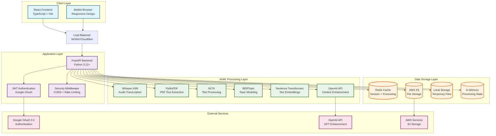
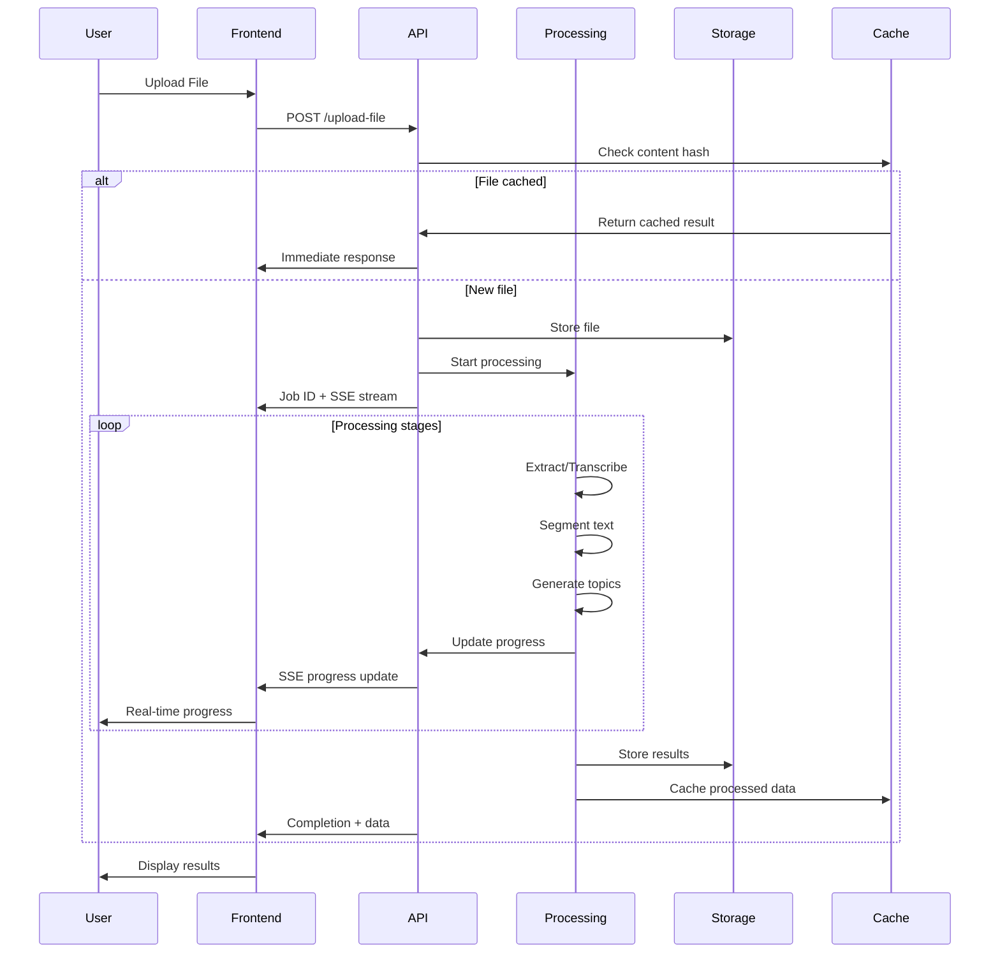
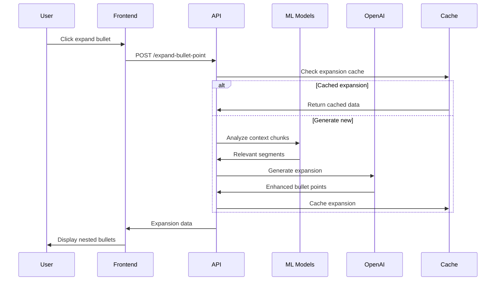
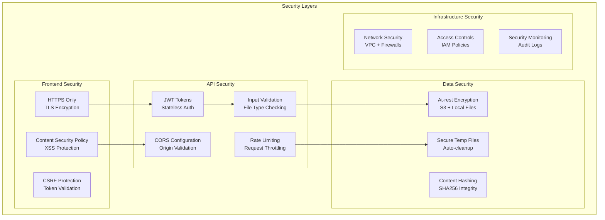
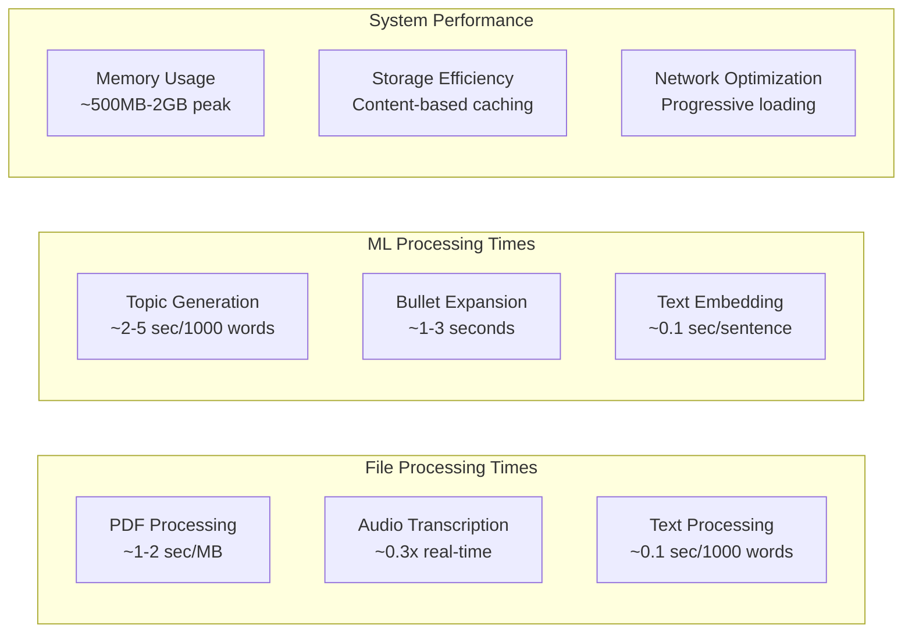

# Firmament System Architecture

## High-Level Architecture Overview



## Detailed Component Architecture

### Frontend Architecture (React + TypeScript)

```mermaid
graph LR
    subgraph "React Frontend"
        App[App.tsx<br/>Main Application]
        
        subgraph "Components"
            Auth[AuthHeader<br/>User Authentication]
            Upload[File Upload<br/>Drag & Drop]
            Progress[Progress Display<br/>Real-time Updates]
            Topics[Topic Display<br/>Interactive Expansion]
            Error[Error Display<br/>User-friendly Messages]
        end
        
        subgraph "Services"
            API[API Service<br/>HTTP Client]
            AuthSvc[Auth Service<br/>Google OAuth]
            Network[Network Utils<br/>Connection Handling]
        end
        
        subgraph "State Management"
            Context[Auth Context<br/>User State]
            Hooks[Custom Hooks<br/>Network Status]
            Local[Local State<br/>Component State]
        end
        
        subgraph "External Libraries"
            Motion[Framer Motion<br/>Animations]
            Tilt[Vanilla Tilt<br/>3D Effects]
            Markdown[React Markdown<br/>Content Rendering]
        end
    end

    App --> Components
    App --> Services
    App --> State Management
    Components --> External Libraries
    Services --> API
```

### Backend Architecture (FastAPI + Python)

```mermaid
graph TB
    subgraph "FastAPI Backend"
        Main[main.py<br/>Application Entry]
        Routes[routes.py<br/>API Endpoints]
        Config[config.py<br/>Environment Management]
        Middleware[middleware.py<br/>Security & CORS]
        
        subgraph "Utilities"
            FileValidator[file_validator.py<br/>Upload Validation]
            ContentCache[content_cache.py<br/>SHA256 Caching]
            Segmentation[semantic_segmentation.py<br/>Text Chunking]
            BERTProcessor[bertopic_processor.py<br/>Topic Modeling]
            ErrorMessages[error_messages.py<br/>User-friendly Errors]
        end
        
        subgraph "Models"
            DataModels[Pydantic Models<br/>Request/Response]
            TypeHints[Type Definitions<br/>Static Typing]
        end
        
        subgraph "Background Tasks"
            FileProcessing[File Processing<br/>Async Tasks]
            ProgressTracking[Progress Tracking<br/>Job Status]
        end
    end

    Main --> Routes
    Routes --> Config
    Routes --> Middleware
    Routes --> Utilities
    Routes --> Models
    Routes --> Background Tasks
```

## Data Flow Architecture

### File Processing Pipeline



### Topic Enhancement Flow



## Security Architecture



## Deployment Architecture

### Development Environment

```mermaid
graph LR
    subgraph "Local Development"
        Dev[Developer Machine]
        
        subgraph "Frontend Dev"
            Vite[Vite Dev Server<br/>localhost:5173]
            HMR[Hot Module Reload<br/>Instant Updates]
        end
        
        subgraph "Backend Dev"
            Uvicorn[Uvicorn Server<br/>localhost:8000]
            Reload[Auto-reload<br/>Code Changes]
        end
        
        subgraph "Services"
            LocalRedis[Local Redis<br/>Cache Testing]
            LocalFiles[Local Storage<br/>Development Files]
        end
    end

    Dev --> Frontend Dev
    Dev --> Backend Dev
    Backend Dev --> Services
```

### Production Environment Options

```mermaid
graph TB
    subgraph "Production Deployment Options"
        subgraph "Cloud Platforms"
            Railway[Railway<br/>Full Stack Deploy]
            Render[Render<br/>Web Services]
            Vercel[Vercel<br/>Frontend Only]
            Heroku[Heroku<br/>App Platform]
        end
        
        subgraph "Container Deployment"
            Docker[Docker Containers<br/>Isolated Environment]
            Compose[Docker Compose<br/>Multi-service]
            K8s[Kubernetes<br/>Orchestrated Scale]
        end
        
        subgraph "Traditional Hosting"
            VPS[VPS Hosting<br/>Full Control]
            Shared[Shared Hosting<br/>Budget Option]
        end
    end

    subgraph "External Services"
        S3Storage[AWS S3<br/>File Storage]
        RedisCloud[Redis Cloud<br/>Managed Cache]
        GoogleAuth[Google OAuth<br/>Authentication]
        OpenAIService[OpenAI API<br/>AI Enhancement]
    end

    Cloud Platforms --> External Services
    Container Deployment --> External Services
    Traditional Hosting --> External Services
```

## Technology Stack Details

### Core Technologies

| Layer | Technology | Purpose | Version |
|-------|------------|---------|---------|
| **Frontend** | React | UI Framework | 18.x |
| | TypeScript | Type Safety | 5+ |
| | Vite | Build Tool | 6+ |
| | Framer Motion | Animations | Latest |
| **Backend** | FastAPI | Web Framework | 0.100+ |
| | Python | Core Language | 3.12+ |
| | Uvicorn | ASGI Server | Latest |
| | Pydantic | Data Validation | 2+ |
| **AI/ML** | Whisper | Speech Recognition | Latest |
| | BERTopic | Topic Modeling | Latest |
| | Transformers | NLP Models | Latest |
| | NLTK | Text Processing | 3.8+ |
| **Storage** | AWS S3 | File Storage | SDK v3 |
| | Redis | Cache/Sessions | 7+ |
| | Local FS | Temp Storage | - |
| **Security** | JWT | Authentication | Latest |
| | Google OAuth | SSO | 2.0 |
| | CORS | Cross-Origin | Built-in |

### Development Tools

| Category | Tool | Purpose |
|----------|------|---------|
| **Code Quality** | ESLint | JavaScript Linting |
| | Prettier | Code Formatting |
| | Pylint | Python Linting |
| | mypy | Type Checking |
| **Testing** | pytest | Python Testing |
| | Jest | JavaScript Testing |
| **Build** | Docker | Containerization |
| | GitHub Actions | CI/CD Pipeline |

## Performance Characteristics

### Processing Performance



### Scalability Considerations

- **Horizontal Scaling**: Stateless API design enables multiple instances
- **Caching Strategy**: Content-based SHA256 caching prevents reprocessing
- **Background Processing**: Async task handling for long operations
- **Resource Management**: Configurable memory limits and cleanup
- **Database Sharding**: Topic data can be distributed across instances

This architecture provides a robust, scalable foundation for AI-powered document analysis and study material generation.
