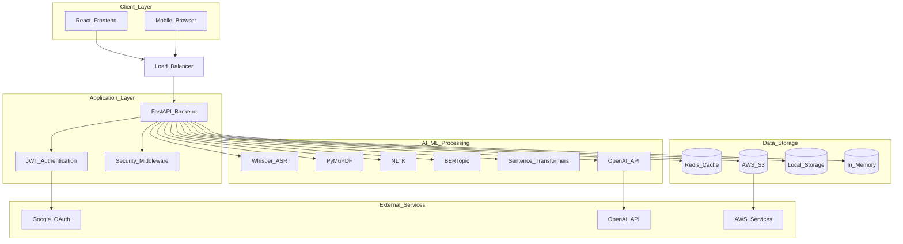
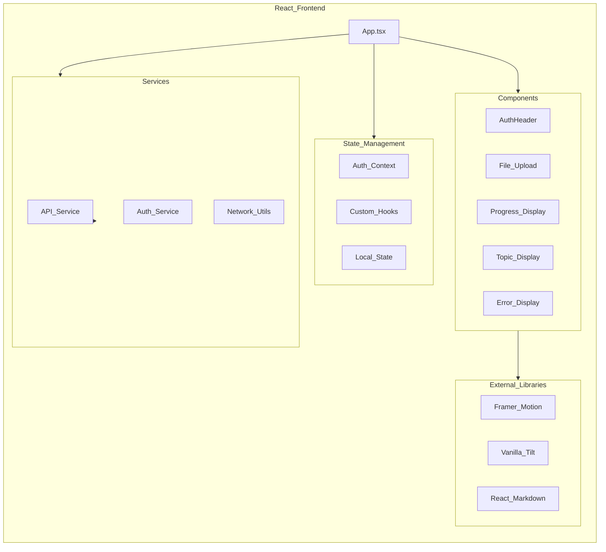
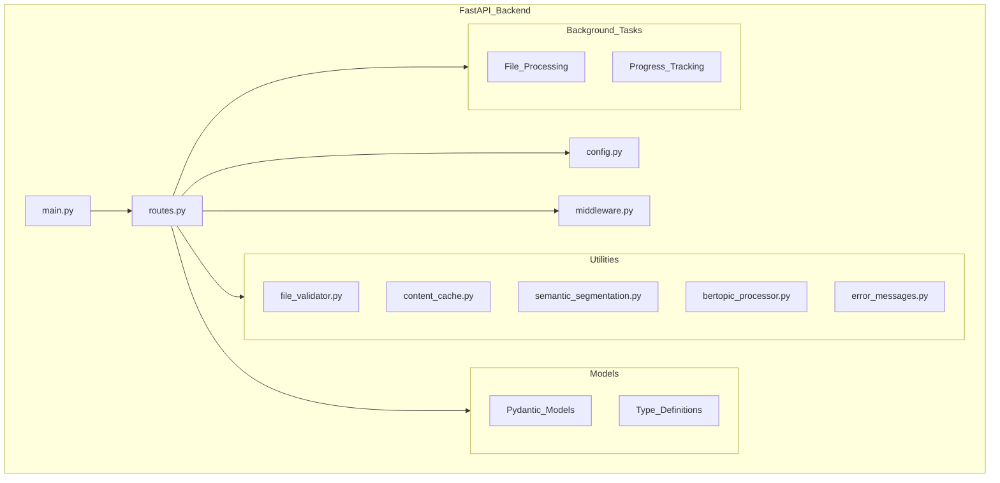
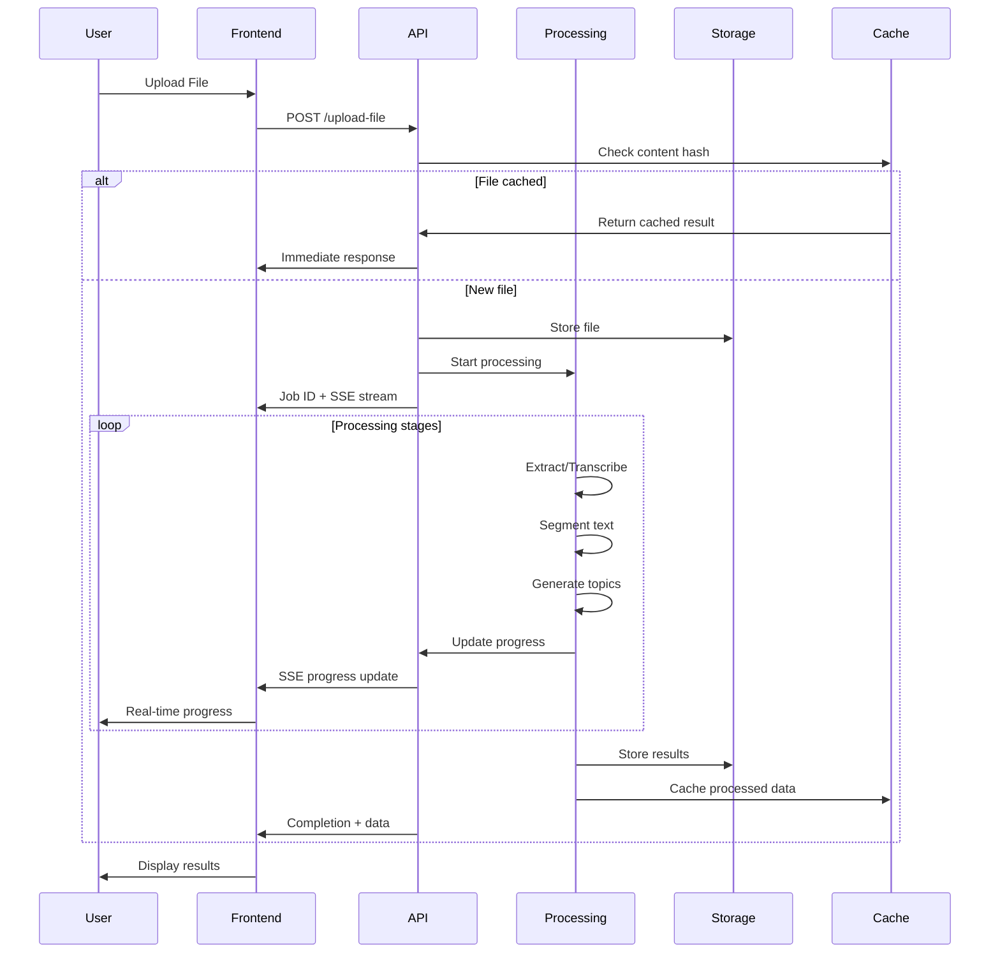
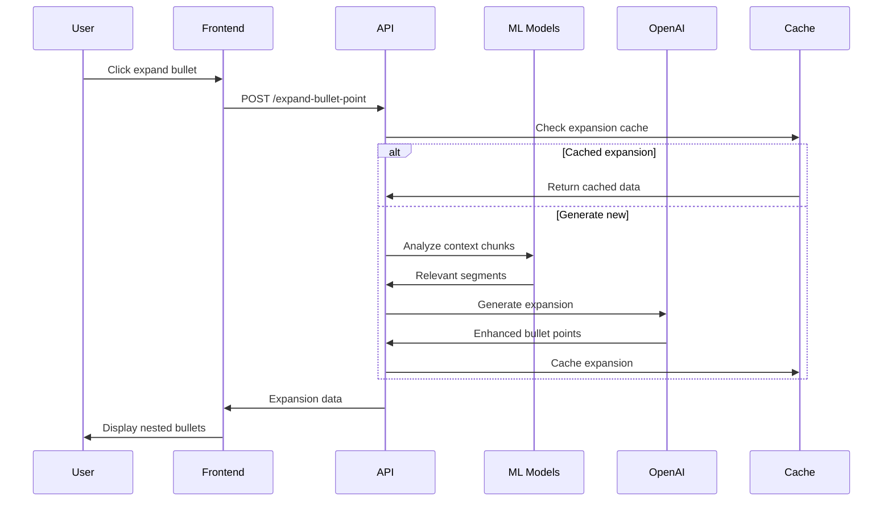
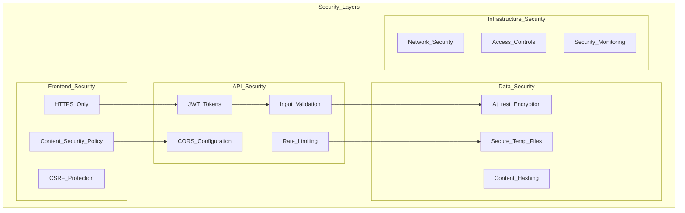
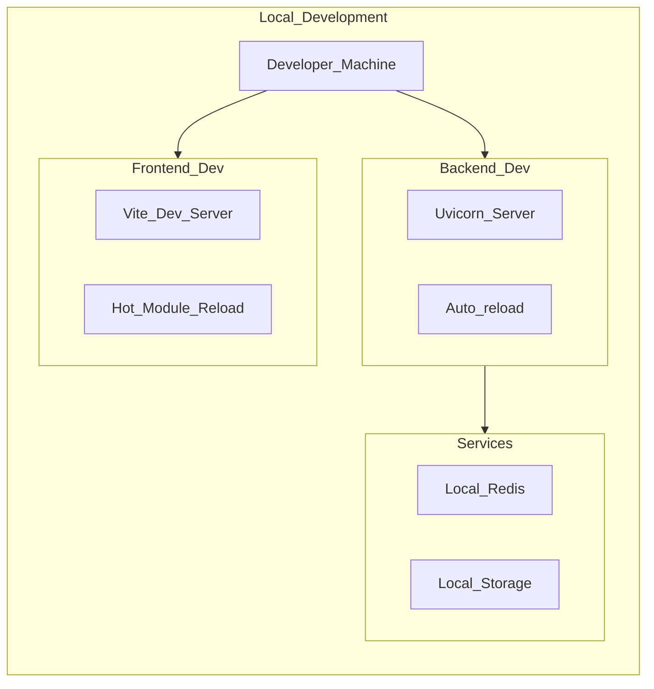
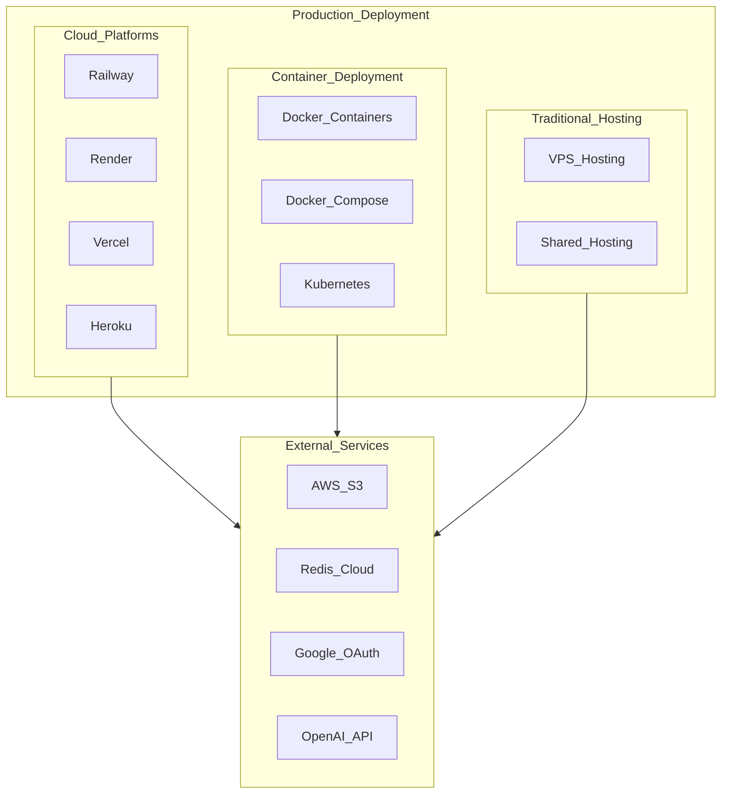

# Firmament System Architecture

## High-Level Architecture Overview

## Detailed Component Architecture

### Frontend Architecture (React + TypeScript)

### Backend Architecture (FastAPI + Python)

## Data Flow Architecture

### File Processing Pipeline

### Topic Enhancement Flow

## Security Architecture

## Deployment Architecture

### Development Environment

### Production Environment Options

## Technology Stack Details

### Core Technologies

| Layer | Technology | Purpose | Version |
|-------|------------|---------|---------|
| **Frontend** | React | UI Framework | 18.x |
| | TypeScript | Type Safety | 5+ |
| | Vite | Build Tool | 6+ |
| | Framer Motion | Animations | Latest |
| **Backend** | FastAPI | Web Framework | 0.100+ |
| | Python | Core Language | 3.12+ |
| | Uvicorn | ASGI Server | Latest |
| | Pydantic | Data Validation | 2+ |
| **AI/ML** | Whisper | Speech Recognition | Latest |
| | BERTopic | Topic Modeling | Latest |
| | Transformers | NLP Models | Latest |
| | NLTK | Text Processing | 3.8+ |
| **Storage** | AWS S3 | File Storage | SDK v3 |
| | Redis | Cache/Sessions | 7+ |
| | Local FS | Temp Storage | - |
| **Security** | JWT | Authentication | Latest |
| | Google OAuth | SSO | 2.0 |
| | CORS | Cross-Origin | Built-in |

### Development Tools

| Category | Tool | Purpose |
|----------|------|---------|
| **Code Quality** | ESLint | JavaScript Linting |
| | Prettier | Code Formatting |
| | Pylint | Python Linting |
| | mypy | Type Checking |
| **Testing** | pytest | Python Testing |
| | Jest | JavaScript Testing |
| **Build** | Docker | Containerization |
| | GitHub Actions | CI/CD Pipeline |

This architecture provides a robust, scalable foundation for AI-powered document analysis and study material generation.
