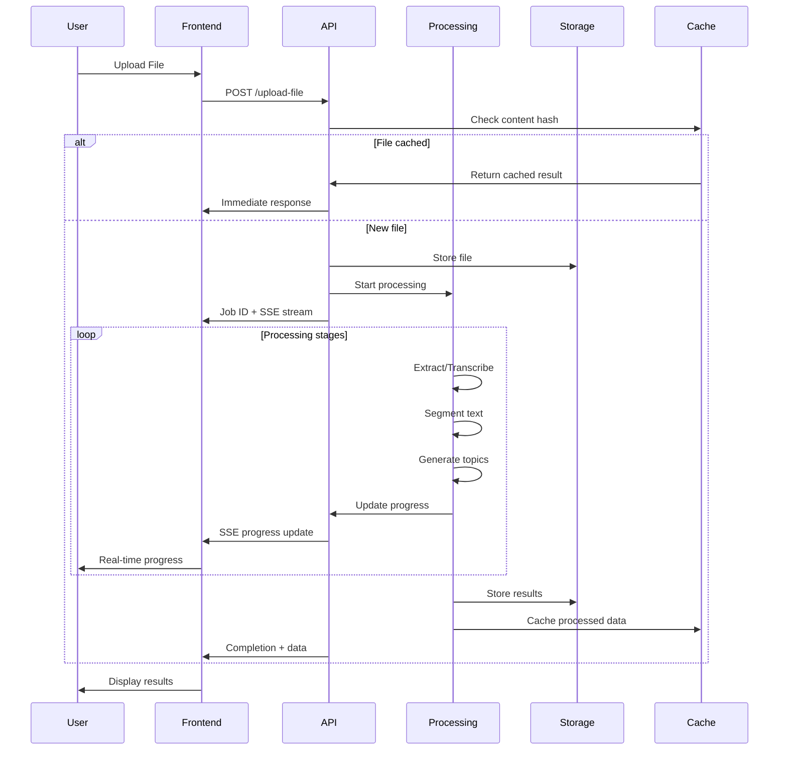
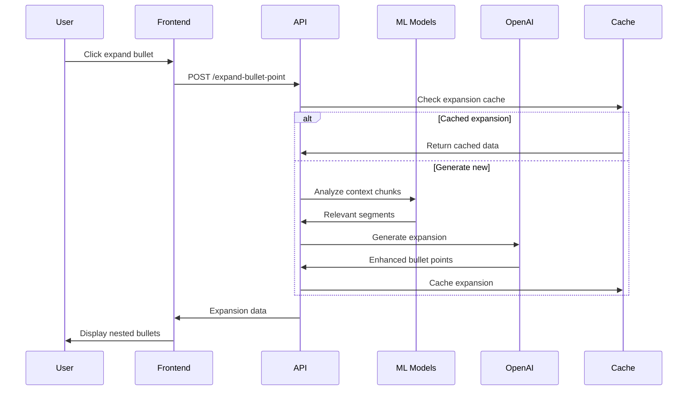
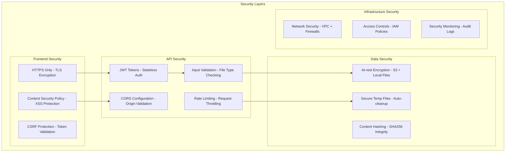

# Firmament System Architecture

## High-Level Architecture Overview

```mermaid
graph TB
    %% Client Layer
    subgraph "Client Layer"
        UI[React Frontend - TypeScript + Vite]
        Mobile[Mobile Browser - Responsive Design]
    end

    %% API Gateway / Load Balancer
    LB[Load Balancer - NGINX/Cloudflare]

    %% Application Layer
    subgraph "Application Layer"
        API[FastAPI Backend - Python 3.12+]
        Auth[JWT Authentication - Google OAuth]
        Middleware[Security Middleware - CORS + Rate Limiting]
    end

    %% Processing Layer
    subgraph "AI/ML Processing Layer"
        Whisper[Whisper ASR - Audio Transcription]
        PyMuPDF[PyMuPDF - PDF Text Extraction]
        NLTK[NLTK - Text Processing]
        BERTopic[BERTopic - Topic Modeling]
        Embeddings[Sentence Transformers - Text Embeddings]
        OpenAI[OpenAI API - Content Enhancement]
    end

    %% Data Layer
    subgraph "Data Storage Layer"
        Redis[(Redis Cache - Session + Processing)]
        S3[(AWS S3 - File Storage)]
        LocalFS[(Local Storage - Temporary Files)]
        Memory[(In-Memory - Processing State)]
    end

    %% External Services
    subgraph "External Services"
        GoogleOAuth[Google OAuth 2.0 - Authentication]
        OpenAIAPI[OpenAI API - GPT Enhancement]
        AWS[AWS Services - S3 Storage]
    end

    %% Connections
    UI --> LB
    Mobile --> LB
    LB --> API
    API --> Auth
    API --> Middleware
    
    API --> Whisper
    API --> PyMuPDF
    API --> NLTK
    API --> BERTopic
    API --> Embeddings
    API --> OpenAI
    
    API --> Redis
    API --> S3
    API --> LocalFS
    API --> Memory
    
    Auth --> GoogleOAuth
    OpenAI --> OpenAIAPI
    S3 --> AWS

    %% Styling
    classDef clientLayer fill:#e1f5fe,stroke:#01579b,stroke-width:2px
    classDef appLayer fill:#f3e5f5,stroke:#4a148c,stroke-width:2px
    classDef mlLayer fill:#e8f5e8,stroke:#1b5e20,stroke-width:2px
    classDef dataLayer fill:#fff3e0,stroke:#e65100,stroke-width:2px
    classDef externalLayer fill:#fce4ec,stroke:#880e4f,stroke-width:2px

    class UI,Mobile clientLayer
    class API,Auth,Middleware appLayer
    class Whisper,PyMuPDF,NLTK,BERTopic,Embeddings,OpenAI mlLayer
    class Redis,S3,LocalFS,Memory dataLayer
    class GoogleOAuth,OpenAIAPI,AWS externalLayer
```



## Detailed Component Architecture

### Frontend Architecture (React + TypeScript)

```mermaid
graph LR
    subgraph "React Frontend"
        App[App.tsx - Main Application]
        
        subgraph "Components"
            Auth[AuthHeader - User Authentication]
            Upload[File Upload - Drag & Drop]
            Progress[Progress Display - Real-time Updates]
            Topics[Topic Display - Interactive Expansion]
            Error[Error Display - User-friendly Messages]
        end
        
        subgraph "Services"
            API[API Service - HTTP Client]
            AuthSvc[Auth Service - Google OAuth]
            Network[Network Utils - Connection Handling]
        end
        
        subgraph "State Management"
            Context[Auth Context - User State]
            Hooks[Custom Hooks - Network Status]
            Local[Local State - Component State]
        end
        
        subgraph "External Libraries"
            Motion[Framer Motion - Animations]
            Tilt[Vanilla Tilt - 3D Effects]
            Markdown[React Markdown - Content Rendering]
        end
    end

    App --> Components
    App --> Services
    App --> State Management
    Components --> External Libraries
    Services --> API
```

### Backend Architecture (FastAPI + Python)

```mermaid
graph TB
    subgraph "FastAPI Backend"
        Main[main.py - Application Entry]
        Routes[routes.py - API Endpoints]
        Config[config.py - Environment Management]
        Middleware[middleware.py - Security & CORS]
        
        subgraph "Utilities"
            FileValidator[file_validator.py - Upload Validation]
            ContentCache[content_cache.py - SHA256 Caching]
            Segmentation[semantic_segmentation.py - Text Chunking]
            BERTProcessor[bertopic_processor.py - Topic Modeling]
            ErrorMessages[error_messages.py - User-friendly Errors]
        end
        
        subgraph "Models"
            DataModels[Pydantic Models - Request/Response]
            TypeHints[Type Definitions - Static Typing]
        end
        
        subgraph "Background Tasks"
            FileProcessing[File Processing - Async Tasks]
            ProgressTracking[Progress Tracking - Job Status]
        end
    end

    Main --> Routes
    Routes --> Config
    Routes --> Middleware
    Routes --> Utilities
    Routes --> Models
    Routes --> Background Tasks
```

## Data Flow Architecture

### File Processing Pipeline



### Topic Enhancement Flow



## Security Architecture



## Deployment Architecture

### Development Environment

```mermaid
graph LR
    subgraph "Local Development"
        Dev[Developer Machine]
        
        subgraph "Frontend Dev"
            Vite[Vite Dev Server - localhost:5173]
            HMR[Hot Module Reload - Instant Updates]
        end
        
        subgraph "Backend Dev"
            Uvicorn[Uvicorn Server - localhost:8000]
            Reload[Auto-reload - Code Changes]
        end
        
        subgraph "Services"
            LocalRedis[Local Redis - Cache Testing]
            LocalFiles[Local Storage - Development Files]
        end
    end

    Dev --> Frontend Dev
    Dev --> Backend Dev
    Backend Dev --> Services
```

### Production Environment Options

```mermaid
graph TB
    subgraph "Production Deployment Options"
        subgraph "Cloud Platforms"
            Railway[Railway - Full Stack Deploy]
            Render[Render - Web Services]
            Vercel[Vercel - Frontend Only]
            Heroku[Heroku - App Platform]
        end
        
        subgraph "Container Deployment"
            Docker[Docker Containers - Isolated Environment]
            Compose[Docker Compose - Multi-service]
            K8s[Kubernetes - Orchestrated Scale]
        end
        
        subgraph "Traditional Hosting"
            VPS[VPS Hosting - Full Control]
            Shared[Shared Hosting - Budget Option]
        end
    end

    subgraph "External Services"
        S3Storage[AWS S3 - File Storage]
        RedisCloud[Redis Cloud - Managed Cache]
        GoogleAuth[Google OAuth - Authentication]
        OpenAIService[OpenAI API - AI Enhancement]
    end

    Cloud Platforms --> External Services
    Container Deployment --> External Services
    Traditional Hosting --> External Services
```

## Technology Stack Details

### Core Technologies

| Layer | Technology | Purpose | Version |
|-------|------------|---------|---------|
| **Frontend** | React | UI Framework | 18.x |
| | TypeScript | Type Safety | 5+ |
| | Vite | Build Tool | 6+ |
| | Framer Motion | Animations | Latest |
| **Backend** | FastAPI | Web Framework | 0.100+ |
| | Python | Core Language | 3.12+ |
| | Uvicorn | ASGI Server | Latest |
| | Pydantic | Data Validation | 2+ |
| **AI/ML** | Whisper | Speech Recognition | Latest |
| | BERTopic | Topic Modeling | Latest |
| | Transformers | NLP Models | Latest |
| | NLTK | Text Processing | 3.8+ |
| **Storage** | AWS S3 | File Storage | SDK v3 |
| | Redis | Cache/Sessions | 7+ |
| | Local FS | Temp Storage | - |
| **Security** | JWT | Authentication | Latest |
| | Google OAuth | SSO | 2.0 |
| | CORS | Cross-Origin | Built-in |

### Development Tools

| Category | Tool | Purpose |
|----------|------|---------|
| **Code Quality** | ESLint | JavaScript Linting |
| | Prettier | Code Formatting |
| | Pylint | Python Linting |
| | mypy | Type Checking |
| **Testing** | pytest | Python Testing |
| | Jest | JavaScript Testing |
| **Build** | Docker | Containerization |
| | GitHub Actions | CI/CD Pipeline |

This architecture provides a robust, scalable foundation for AI-powered document analysis and study material generation.
