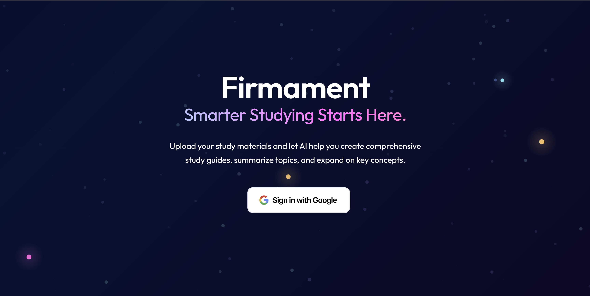
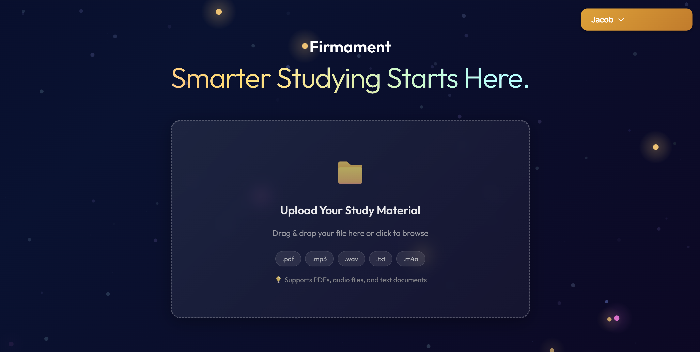
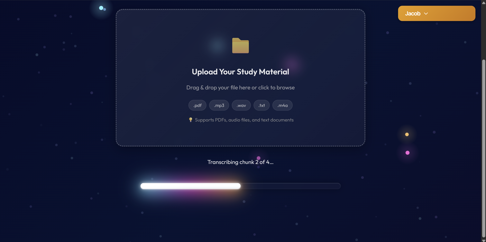
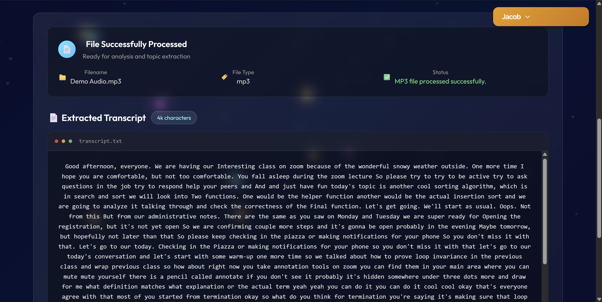
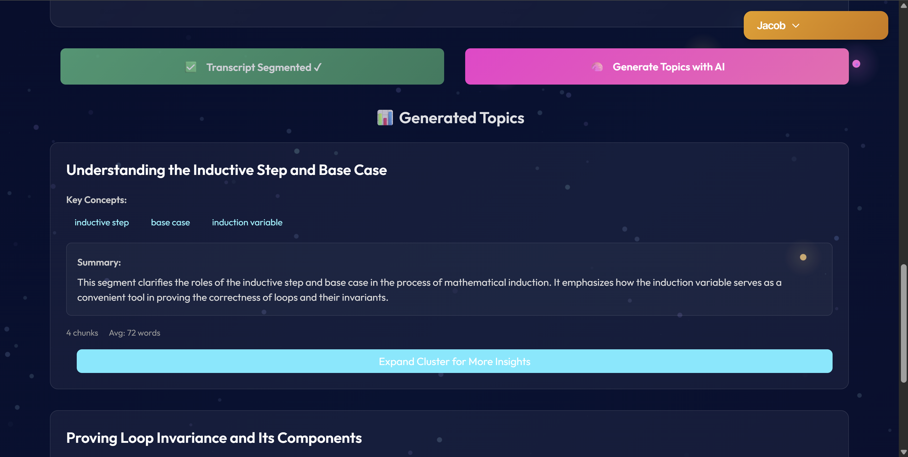
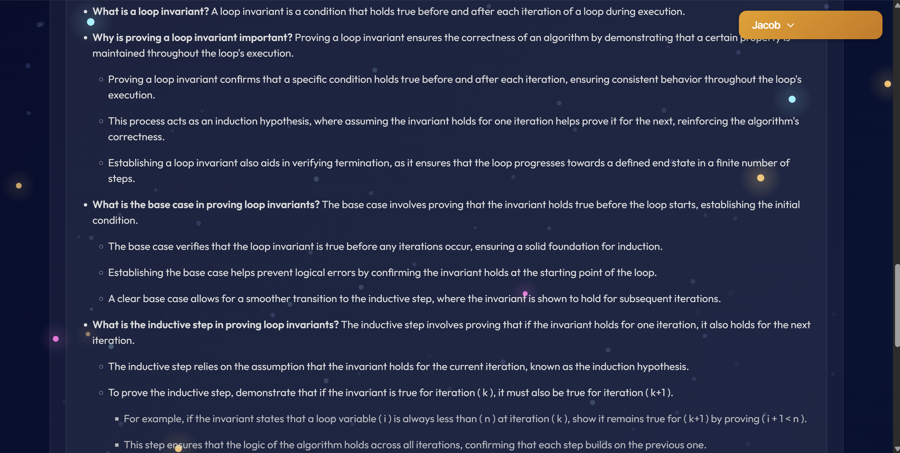
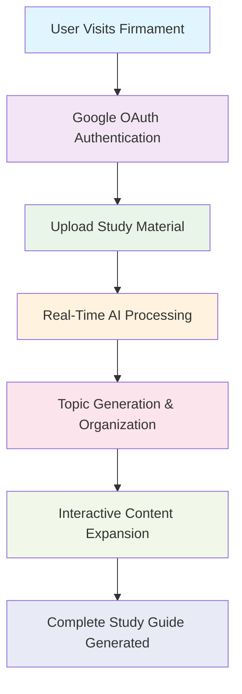

# Firmament - Visual Demo & Feature Showcase

## 🎯 Overview

Firmament is a sophisticated AI-powered study material generator that transforms documents and audio into interactive, comprehensive study guides. This visual demonstration showcases the complete user journey from authentication through advanced AI processing.

---

## 🖼️ Application Screenshots

### 1. Welcome & Authentication

**Key Features Demonstrated:**
- **Elegant Dark Theme UI** with particle effects and smooth animations
- **Google OAuth Integration** for secure, seamless authentication
- **Professional Branding** with clear value proposition
- **Responsive Design** optimized for all screen sizes
- **Call-to-Action** that guides users naturally into the workflow

**Technical Highlights:**
- React 19 with Framer Motion animations
- TypeScript for type safety and reliability
- Custom particle system using Web Workers
- Accessibility-compliant design patterns

---

### 2. File Upload Interface

**Key Features Demonstrated:**
- **Drag & Drop Upload** with visual feedback and hover states
- **Multi-Format Support** - PDFs, audio files (MP3, WAV, M4A), and text documents
- **File Validation** with clear format requirements and size limits
- **Progress Indicators** showing real-time upload status
- **User-Friendly Instructions** with supported file type badges

**Technical Highlights:**
- Comprehensive client-side validation before server processing
- Secure file handling with content-type verification
- Real-time progress tracking via Server-Sent Events
- Memory-efficient upload handling for large files

---

### 3. AI Processing Pipeline

**Key Features Demonstrated:**
- **Real-Time Progress Updates** showing transcription stages
- **Multi-Stage Processing** from upload through AI analysis
- **Transparent Progress Tracking** with detailed status messages
- **Smooth Progress Animations** enhancing user experience
- **Background Processing** allowing users to understand what's happening

**Technical Highlights:**
- Whisper AI for speech-to-text transcription
- Asynchronous processing with background task queues
- WebSocket-like real-time communication
- Intelligent progress estimation and user feedback

---

### 4. AI-Generated Topic Organization

**Key Features Demonstrated:**
- **Intelligent Topic Extraction** using advanced NLP and topic modeling
- **Clean Content Organization** with automatically generated headings
- **Semantic Segmentation** grouping related content logically
- **Interactive Topic Display** with expandable sections
- **Professional Formatting** making complex content digestible

**Technical Highlights:**
- BERTopic for advanced topic modeling and clustering
- NLTK for natural language processing and text segmentation
- Sentence Transformers for semantic understanding
- Content-based caching to avoid reprocessing identical materials

---

### 5. Interactive Content Expansion

**Key Features Demonstrated:**
- **AI-Powered Content Enhancement** expanding key concepts into detailed explanations
- **Nested Bullet Structure** supporting multiple levels of detail
- **Interactive Click-to-Expand** functionality for progressive disclosure
- **Contextual Information** generated from the original source material
- **Unlimited Depth Expansion** allowing thorough exploration of topics

**Technical Highlights:**
- OpenAI API integration for content enhancement
- Intelligent context selection from source documents
- Nested data structure management for complex expansions
- Efficient state management for interactive UI components

---

### 6. Complete Study Material Generation

**Key Features Demonstrated:**
- **Comprehensive Study Materials** transformed from raw input
- **Hierarchical Information Architecture** with clear topic organization
- **Rich Text Formatting** using Markdown for enhanced readability
- **Interactive Navigation** between different sections and topics
- **Professional Presentation** suitable for academic and professional use

**Technical Highlights:**
- Full-stack AI processing pipeline from upload to final output
- Persistent data storage and retrieval systems
- Responsive design ensuring accessibility across devices
- Content optimization for study effectiveness

---

## 🚀 User Journey Flow

## 🎯 Key Value Propositions Demonstrated

### For Students
- **Time Savings**: Automated study guide generation from any source material
- **Better Organization**: AI-powered topic modeling creates logical content structure
- **Enhanced Understanding**: Interactive expansion provides deeper context
- **Multi-Format Support**: Works with PDFs, lectures, audio recordings, and notes

### For Professionals
- **Meeting Transcription**: Convert recorded meetings into organized action items
- **Document Analysis**: Extract key insights from reports and presentations
- **Training Materials**: Transform complex documents into digestible learning resources
- **Knowledge Management**: Organize and enhance institutional knowledge

### For Educators
- **Curriculum Development**: Generate comprehensive study materials from source content
- **Student Support**: Provide enhanced learning resources automatically
- **Content Enhancement**: Expand existing materials with AI-generated explanations
- **Accessibility**: Convert audio lectures into structured, searchable text

---

## 🔧 Technical Excellence Demonstrated

### Frontend Innovation
- **Modern React Architecture** with hooks and context for state management
- **TypeScript Integration** ensuring type safety and development efficiency
- **Advanced Animations** using Framer Motion for engaging user experience
- **Web Worker Integration** for performance-intensive background tasks
- **Responsive Design** with mobile-first approach

### Backend Sophistication  
- **FastAPI Framework** providing high-performance async API endpoints
- **Multi-Stage AI Pipeline** integrating multiple specialized AI models
- **Intelligent Caching** using content-based hashing for efficiency
- **Secure Authentication** with JWT tokens and Google OAuth integration
- **Comprehensive Error Handling** with user-friendly error messages

### AI/ML Integration
- **Whisper AI** for state-of-the-art speech recognition
- **BERTopic** for advanced topic modeling and content clustering
- **Sentence Transformers** for semantic text understanding
- **OpenAI API** for intelligent content enhancement and expansion
- **NLTK** for natural language processing and text segmentation

### DevOps & Production Readiness
- **Docker Containerization** for consistent deployment environments
- **Multi-Environment Configuration** supporting development and production
- **Health Monitoring** with comprehensive system health checks
- **Security Best Practices** including CORS, rate limiting, and input validation
- **Scalable Architecture** designed for horizontal scaling and high availability

---

## 🎉 Portfolio Impact

This application demonstrates:

1. **Full-Stack Development Expertise**: Complete end-to-end application development
2. **AI/ML Integration Skills**: Practical application of multiple AI technologies
3. **User Experience Design**: Thoughtful UX/UI with attention to detail
4. **Software Architecture**: Scalable, maintainable, and secure system design
5. **Modern Technology Stack**: Current best practices and tools
6. **Production Readiness**: Enterprise-grade security and deployment considerations

Firmament showcases the ability to create sophisticated, AI-powered applications that solve real-world problems while maintaining high standards for code quality, user experience, and system architecture.
